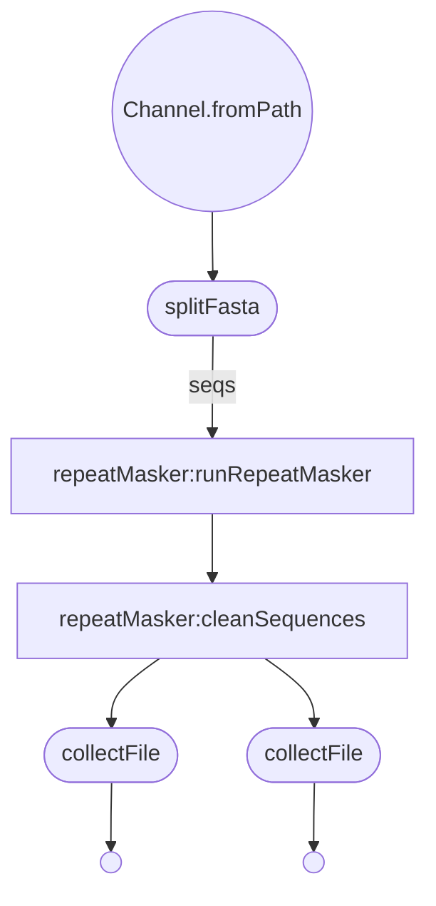

# Nextflow Conversion of repeatMaskerTask.pm

***
RepeatMasker
***  

### Get Started
  * Install Nextflow
    
    `curl https://get.nextflow.io | bash`
  
  * Run the script
    
    `nextflow run VEuPathDB/tRNAScan -with-trace -c  <config_file> -r main`

### Description of nextflow configuration parameters:

| param         | value type        | description  |
| ------------- | ------------- | ------------ |
| inputFilePath | string| Path to the input fasta file. |
| trimDangling | boolean | Would you like to remove sections of masked repeats or not? |
| dangleMax | integer | Number of nucleotides required between sections of repeats to stop removal process. |
| outputFileName | string | How you would like the output file named. |
| outputDir | string | Where you would the the output file to be stored. |
| rmParams | string | Additional arguments to be passed to RepeatMasker |
| errorFileName | string | How you would like the error file named |
| libraryPath | string | rmParams "-species" will not work due to dfam files not containing full library. These would be to large to include in container. Instead, I will be adding a parameter, libraryPath. This will be used to set an environment variable LIBDIR, which repeatMasker will use. If you are running this locally, or only want to use the curated versions of the databases, you can just leave it as /opt/RepeatMasker/Libraries. If you want to data that does not come standard, please supply the path to the RepeatMasker libraries. |
  
  - **trimDangling Explained**: The trimDangling process will move through a masked sequence, once from the forward and once from the reverse directions, while looking for sections of 9 or more 'N's. dangleMax specifies the minimum number of nucleotides required to halt this process. Once this is done in the forward direction, it will begin in the reverse.

  - **Example**:
          
          If dangleMax was set to 9...
          AAAAAANNNNNNNNNAAANNNNNNNNNAAAAAAAAANNNNNNNNNNNNAAAAAAAAAAAAAAANNNNNNAAAAAAAAANNNNNNNNNAAAAAANNNNNNNNNAAAAAA
            6       9     3     9         9       12            15          6       9       9       6       9      6
          
          After the forward pass ...
          AAAAAAAAANNNNNNNNNNNNAAAAAAAAAAAAAAANNNNNNAAAAAAAAANNNNNNNNNAAAAAANNNNNNNNNAAAAAA    
              9        12           15          6      9         9      6       9      6
          After the reverse pass...
          AAAAAAAAANNNNNNNNNNNNAAAAAAAAAAAAAAANNNNNNAAAAAAAAA
               9        12           15          6      9
